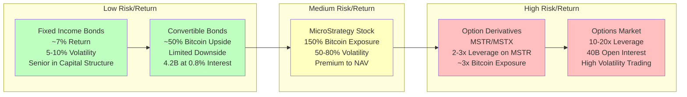

## Based on Microstrategy's offerings different risk profile investors can use different products

1. Low Risk Products:
- Fixed Income Bonds
  * Target: Conservative investors seeking steady returns
  * Features: Fixed interest rates around 7%
  * Lower volatility (5-10%)
  * Senior position in capital structure
  * Suitable for fixed income funds and retirees

- Convertible Bonds
  * $4.2 billion issued at 0.8% interest
  * Offers ~50% of Bitcoin upside with limited downside
  * 4x overcollateralized
  * Appeals to risk-averse investors wanting some Bitcoin exposure

2. Medium Risk Products:
- MicroStrategy Stock (MSTR)
  * Core offering with 150% Bitcoin exposure
  * Trades at premium to Net Asset Value
  * 50-80% volatility
  * Permanent capital structure
  * Targeted at long-term Bitcoin believers

3. High Risk Products:
- Derivative Products (MSTU/MSTX)
  * 2-3x leverage on MicroStrategy stock
  * Approximately 3x Bitcoin exposure
  * Higher volatility than underlying stock
  * For sophisticated investors seeking amplified returns

- Options Market
  * Up to 10-20x leverage
  * $40 billion in open interest
  * Extremely high volatility
  * For "degenerate traders" seeking maximum exposure
  * Both long calls and short puts available

This spectrum allows MicroStrategy to serve as a "Bitcoin securities company" that can transform "crude" Bitcoin capital into various financial products matching different risk appetites and regulatory requirements in traditional finance.

## The diagram illustrates:
- A gradient background representing increasing risk levels from left to right
- Five main product categories organized by risk level
- Key characteristics and metrics for each product
- Arrows showing the progression and relationships between products
- Clear separation between low, medium, and high-risk offerings

The visual layout helps demonstrate how MicroStrategy has created a complete ecosystem of Bitcoin-based financial products catering to different investor profiles, from conservative fixed-income seekers to aggressive traders seeking maximum leverage.